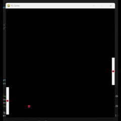

# 🏓 RL Pong (DQN) · Pygame + Keras

[](https://python.org)
[](https://tensorflow.org)
[](https://pygame.org)

> Basit bir Pong benzeri ortamda iki ajanla Deep Q-Learning (DQN) eğitimi.

Kod öğretici/deneysel amaçlıdır; şimdilik başarı seviyesi sınırlıdır. Geliştirmeye tamamen açık ve farklı sürümleri planlanmaktadır.

> ⚠️ **Not:** Depo boyutu/dağıtım kısıtları nedeniyle uzun eğitim (çok episode) sonucu oluşan büyük model dosyaları repoda yer almıyor. Checkpoint mantığı mevcut; kendi eğitimlerinizle devam edebilirsiniz.

---

---

## ✨ Özellikler

- 🎮 **Pygame tabanlı minimal Pong ortamı** (sol & sağ ped + top)
- 🧠 **Küçük MLP + LeakyReLU aktivasyon**
- ⚡ **Vektörize Replay** (tek fit, birkaç predict)
- 💾 **Checkpoint + Resume:**
  - Model ağırlıkları ve optimizer durumu (`.keras`)
  - Ajan durumu (epsilon + replay buffer) (`.state.gz`)
- 🖥️ **GPU opsiyonel** (küçük ağlarda CPU daha akıcı olabilir)

---

## 📋 Gereksinimler
Projeyle test edilmiş örnek sürümler:
- **Python** 3.7
- **TensorFlow** 2.10–2.14 (Keras dâhil)
- **pygame** 2.1+
- **numpy** 1.23+

### 🚀 Hızlı kurulum (conda)

```bash
conda create -n rl_codes python=3.9 -y
conda activate rl_codes
pip install "tensorflow==2.12.*" pygame==2.1.2 numpy==1.24.*
```

> 💡 **Not:** Küçük ağlarda pencere takılması görürseniz GPU'yu kapatıp CPU'da çalıştırın (TF importundan önce):
> ```python
> import os
> os.environ["CUDA_VISIBLE_DEVICES"] = "-1"
> ```

---

## 🎯 Çalıştırma
Proje tek dosyadır (örn. main.py). Çalıştırın:

```bash
python main.py
```

- `models/` dizininde önceden checkpoint varsa otomatik kaldığı yerden devam eder
- Yoksa 1. bölümden başlar
- Varsayılan olarak her 50 bölümde checkpoint alınır (model + ajan durumu)

### 💾 Checkpoint biçimi

- **Model:** `models/agent1_ep{N}.keras`, `models/agent2_ep{N}.keras`
  - (ağırlık + optimizer state → gerçek resume)
- **Ajan durumu:** `models/agent{X}_ep{N}.state.gz`
  - (epsilon + replay buffer)

**LeakyReLU ile yükleme (örnek):**
```python
from tensorflow.keras.layers import LeakyReLU
model = load_model("models/agent1_ep150.keras",
                   custom_objects={"LeakyReLU": LeakyReLU})
```

---

## 🎮 Oynatma (Play) Modu
Eğitim yerine sadece oynamak istiyorsanız, eğitilmiş modelleri yükleyip aksiyonları `argmax(Q)` ile seçen kısa bir döngü ekleyebilirsiniz.

> ⚠️ **Önemli:** `getCoordinate()` eğitimle aynı olmalı (bu projede `(rect.x, rect.y)`).

> 💡 **İpucu:** Eğitimde kullandığınız FPS ile Play FPS aynı olsun; aksi halde dinamikler değişir.

---

## 🏗️ Proje Yapısı (özet)

- **Tick / Ball / Env:** Pygame sprite'ları ve ortam
- **DQLAgent:**
  - `build_model()`: 32-32 MLP + LeakyReLU
  - `remember()`, `act()`
  - `replay()`: vektörize DQN güncellemesi
  - `adaptiveEGreedy()`: epsilon azaltımı
- **Checkpoint:** `.keras` + `.state.gz` (atomik yazım)
- **Resume:** En güncel ortak episode otomatik bulunur

---

## ⚠️ Bilinen Sınırlamalar
- 🎯 Kod bilinçli olarak basit tutuldu; "gerçek Pong" fiziği yok
- 📈 Başarı seviyesi şu an yeterli değil; daha uzun eğitim ve/veya ödül/mimari iyileştirmeleri gerekiyor
- 💾 Uzun eğitim sonucu oluşan büyük modeller repoya dâhil edilmedi (dosya boyutu ve kaynak kısıtları)

---

## 🗺️ Yol Haritası / Katkı

### Planlanan/önerilen geliştirmeler:

- 🎯 **Target Network (DDQN)**
- 📊 **Prioritized Replay**
- 🏆 **Ödül shaping** (temas +r, yönlü bonus vs.)
- ⚙️ **Fizikte deterministikleştirme** ve tünelleme önleme iyileştirmeleri
- 🤖 **Tek ajan vs. scripted/heuristic rakip** (öğrenmeyi kolaylaştırır)
- 🔍 **Parametre taramaları** (LR, epsilon planı, batch size, LeakyReLU alpha)
- 📈 **Loglama/plot** (ör. TensorBoard, matplotlib)

> 🤝 **PR ve önerilere açığız.** Sorun/iyileştirme için lütfen Issue açın.

---

## 📄 Lisans

**MIT** (veya dilediğiniz lisansı belirtin)

---

## 🙏 Teşekkür

Bu çalışma, öğrenme/deney amaçlı minimal bir DQN iskeleti sunmayı hedefler. Geri bildirim ve katkılarınız projeyi daha iyi hâle getirecek.


---
